  <table>
    <thead>
      <tr>
        <th rowspan="3">
          
        </th>
        <th>
          
        </th>
      </tr>
      <tr>
        <th>
          
        </th>
      </tr>
      <tr>
        <th>
          
        </th>
      </tr>
    </thead>    
    <tbody>
      <tr>
        <td>
          
        </td>
        <td>
          <a href="https://discord.com/users/743448459029381221">
            
        </td>
      </tr>
    </tbody>
  </table>

